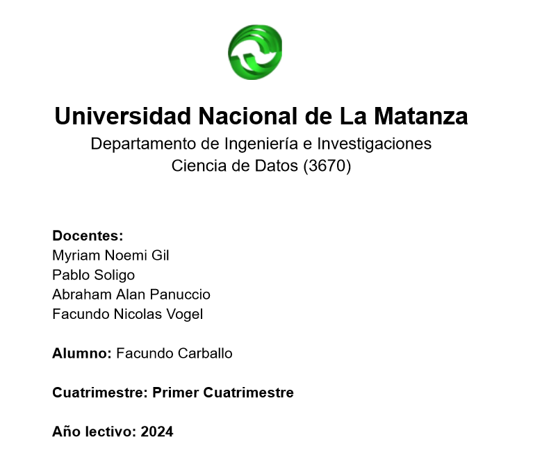

## Trabajo Practico - Ciencia de Datos

#### Universidad Nacional de la Matanza - 2024

##### Primer Cuatrimestre

---

### Modelos posibles de entrenamiento

Estamos ante un dataset de datos no discretos, sino mas bien continuos. Por lo tanto algunos modelos de entrenamiento como el `MultinomialNB` no los voy a considerar, ya que estos se desempenan mejor con datasets discretos.

- GaussianNB
- DecisionTreeClassifier
- LogisticRegression

---

# Paso a Paso del desarrollo del modelo final

El paso a paso de las predicciones se encuentra en la carpeta `paso-a-paso`

---

# Como ejecutar el modelo?

Ejecutar todas las celdas que estan dentro de `Desarrollo` y el modelo quedara correctamente entrenado

## Modelos de Entrenamiento

Esta seccion contiene una clase con los modelos de entrenamiento que fui probando.

## Analisis del Dataset

Esta seccion solo la uso para analizar los datos, no modifico el dataset original con el que finalmente hago las modificaciones en el `Pipeline`

## Pipeline

Aca es donde se aplican todas las transformaciones y se entrena el modelo.

## GridSearchCV

Esta seccion solo la use para ver cual puede ser la mejor configuracion de hiperparametros para entrenar el modelo, dependiendo de cada modelo elegido.
