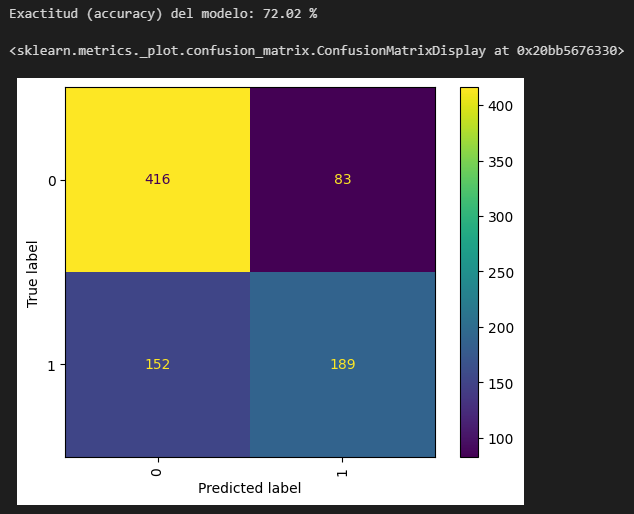
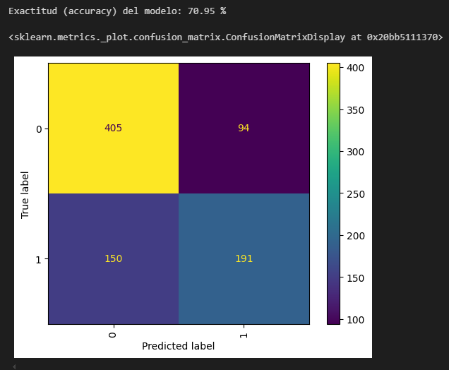
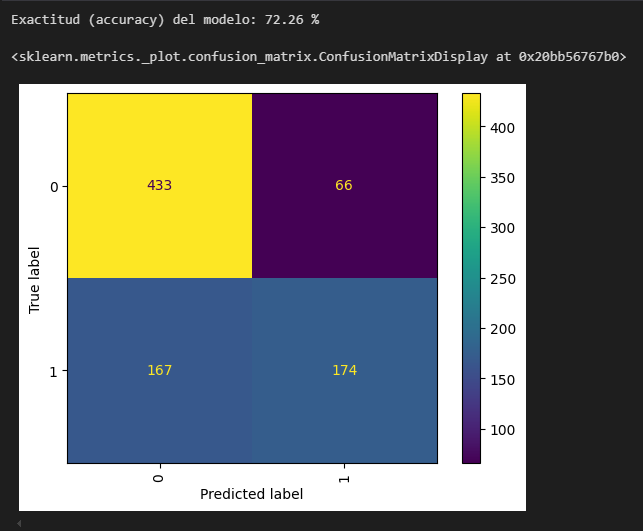

# Primera Prediccion

En esta primera prediccion utilice el dataset tal como vino, simplemente le hice estas modificaciones:

1. Elimine las columnas que contenian datos nulos
   - `Edad`
   - `Genero`
   - `LVL`
2. Modifique la columna `Laboral` para cambiar el tipo de dato `string` a uno convertible a `float`
   - `Inactivo` -> 0
   - `Activo` -> 1
   - `No_declara` -> 2

Igualmente, me da la sensacion de que esta columna `Laboral` no aporta informacion suficiente al modelo para poder predecir, mas que nada porque se trata de una variable discreta cuando estamos enfrentando un dataset con datos continuos.

### Resultados obtenidos

Entrene esta primera iteracion de los datos procesados con los siguientes modelos y estos fueron sus resultados

#### Logistic Regression

##### Analisis de los resultados

Viendo estos resultados, tanto el % de accurracy como la matriz de confusion; me doy cuenta que se puede mejorar bastante la prediccion, ya que hay 83 casos que fueron `Falsos_Positivos` que son los casos que queremos evitar a toda costa.

Se equivoca bastante, diciendo que no tienen el virus cuando en realidad si lo tienen `Falsos_Negativos` habria que ajustar este tambien, pero el mas importante sigue siendo los `Falsos_Positivos`

#### Decission Tree Classifier

##### Analisis de los resultados

Este acierta mas a los positivos (personas que tienen el virus), pero se equivoca mas en los que no tienen el virus pero aun asi los predice como positivos.

Se puede mejorar, lo voy a seguir teniendo en cuenta para futuras predicciones.

#### GaussianNB

##### Analisis de los resultados

Es el de mejor resultado hasta ahora.
